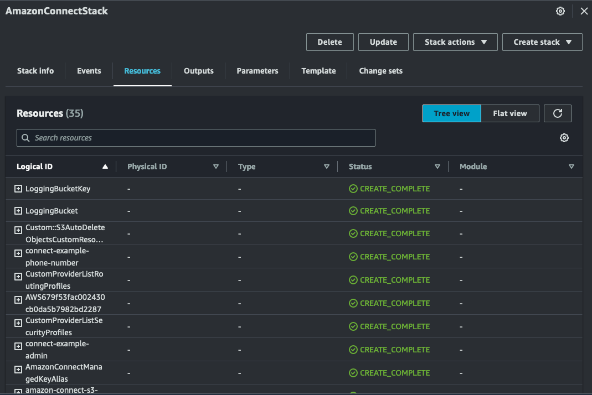

# amazon-connect-java-cdk

Java AWS CDK application to create Amazon Connect with basic configuration.

## Pre-requisites

* AWS Account
* Java 11 or later
```
java -version
```
* Maven 3.0 or later
```
mvn -version
```
* AWS CLI
```
aws --version
```

* Node.js 18.x or later
```
node -v
```

* AWS CDK - Install the [AWS CDK Toolkit](https://docs.aws.amazon.com/cdk/v2/guide/cli.html) globally using the following command:
```
npm install -g aws-cdk
```
```
cdk --version
```
* CDK Bootstrap - Bootstrap your AWS account for CDK. This only needs to be done once per account/region.
```
cdk bootstrap aws://<account>/<region>
```

## Installation

Clone the repository and navigate to the project directory.
```
git clone git@ssh.gitlab.aws.dev:aruthan/amazon-connect-java-cdk.git
cd amazon-connect-java-cdk
```

## Build
Run below build command from the root directory of the project.
```
mvn clean install
```

## Deployment

Change to the Infra directory of the project.
```
cd Infra
```

Quick deployment: This will deploy the application with default options for parameters connectInstanceAlias and connectAdminUserEmailId.<br>
Run the below command to deploy the application.
```
cdk deploy
```

Custom deployment: Pass your values to the parameters.<br>
Run the below command to deploy the application.
```
cdk deploy --no-previous-parameters --parameters connectInstanceAlias=<Unique Alias> --parameters connectAdminUserEmailId=<Email Id> 
```

## Verify
Make sure you are in the right AWS account and region.

[AWS CloudFormation](https://us-west-2.console.aws.amazon.com/cloudformation/home) will create the below resources.


## Testing

Validate Amazon Connect Instance is created with all recommended configuration.

## Cleanup

Run the below command to delete the application.
```
cdk destroy
```
