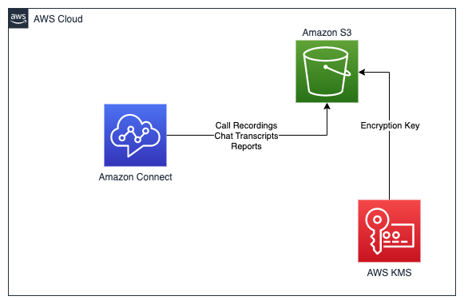

# amazon-connect-java-cdk

This repository provides an example of deploying an Amazon Connect instance using the AWS Cloud Development Kit (CDK) and Java. Amazon Connect is a cloud-based contact center service provided by Amazon Web Services (AWS). With the help of CDK, you can provision and manage your Amazon Connect resources using infrastructure-as-code principles.

## Architecture



## Pre-requisites

Before getting started, make sure you have the following:

- AWS Account
- Java Development Kit (JDK) installed on your local machine
  - Java 11 or later. If missing install Amazon Corretto Java 11 from [here](https://docs.aws.amazon.com/corretto/latest/corretto-11-ug/what-is-corretto-11.html).
    ```shell
    java -version
    ```
    
  - Maven 3.8 or later. If missing install Maven from [here](https://maven.apache.org/download.cgi).
  - Note: Java version showed in the below output should be 11 or later.
    ```shell
    mvn -version
    ```

- AWS CLI configured with valid credentials
  - AWS CLI. If missing install AWS CLI from [here](https://docs.aws.amazon.com/cli/latest/userguide/install-cliv2.html).
    ```shell
    aws --version
    ```
- Node.js and npm installed (required for CDK)
  - Node.js 18.x or later. If missing install Node.js from [here](https://nodejs.org/en/download/).
    ```shell
    node -v
    ```

- AWS CDK - Install the [AWS CDK Toolkit](https://docs.aws.amazon.com/cdk/v2/guide/cli.html) globally using the following command:
    ```shell
    npm install -g aws-cdk
    ```
    ```shell
    cdk --version
    ```
  - CDK Bootstrap - Bootstrap your AWS account for CDK. This only needs to be done once per account/region.
    ```shell
    cdk bootstrap aws://<account>/<region>
    ```

## Installation

Clone this repository and navigate to the project directory.
```shell
git clone https://github.com/aws-samples/amazon-connect-java-cdk.git
cd amazon-connect-java-cdk
```

## Build
Run below build command from the root directory of the project.
```shell
mvn clean install
```

## Deployment

Change to the Infra directory of the project.
```shell
cd Infra
```

Quick deployment: This will deploy the application with default options for parameters connectInstanceAlias <br>
Run the below command to deploy the application.
```shell
cdk deploy
```

Custom deployment: Pass your values to the parameters.<br>
Run the below command to deploy the application.
```shell
cdk deploy --no-previous-parameters --parameters connectInstanceAlias=<Unique Alias>
```

## Verify
Make sure you are in the right AWS account and region.

[AWS CloudFormation](https://us-west-2.console.aws.amazon.com/cloudformation/home) will create similar to below resources 
<br> Note: Not all the resources are shown in the screenshot below.


## Testing

Validate Amazon Connect Instance is created from AWS Management Console.

## Cleanup

Run the below command to delete the application.
```shell
cdk destroy
```
This will delete the provisioned Amazon Connect instance and any related resources from your AWS account.

---

## Code Snippets

Refer to `AmazonConnectStack.java` for full stack code

#### Create Amazon Connect Instance: 
```
        // Amazon Connect Instance
        CfnInstance amazonConnect = CfnInstance.Builder.create(this, "connect-example")
                .instanceAlias(connectInstanceAlias.getValueAsString())
                .attributes(CfnInstance.AttributesProperty.builder()
                        .autoResolveBestVoices(true)
                        .contactflowLogs(true)
                        .contactLens(true)
                        .inboundCalls(true)
                        .outboundCalls(true)
                        .build())
                .identityManagementType(userMgmtType.getValueAsString())
                .build();
```

#### Claim Phone Number:
```
        // Claim Phone Number for Amazon Connect Instance
        CfnPhoneNumber.Builder.create(this, "connect-example-phone-number")
                .countryCode("US")
                .targetArn(amazonConnect.getAttrArn())
                .type("TOLL_FREE")
                .build();
```

#### Access Existing Routing Profile ARN:
```
        // API Call to get Routing Profile ARN
        AwsSdkCall listRoutingProfiles = AwsSdkCall.builder()
                .service("Connect")
                .action("listRoutingProfiles")
                .parameters(Map.of("InstanceId", amazonConnect.getAttrId()))
                .physicalResourceId(PhysicalResourceId.of("CustomProviderListRoutingProfiles"))
                .build();

        AwsCustomResource awsCustomResourceListRoutingProfiles = AwsCustomResource.Builder.create(this, "CustomProviderListRoutingProfiles ")
                .onCreate(listRoutingProfiles)
                .policy(AwsCustomResourcePolicy.fromSdkCalls(SdkCallsPolicyOptions.builder()
                        .resources(AwsCustomResourcePolicy.ANY_RESOURCE)
                        .build()))
                .build();

        String routingProfileARN = awsCustomResourceListRoutingProfiles.getResponseField("RoutingProfileSummaryList.0.Arn");
```

#### Create Amazon Connect Hours of Operation:
```
        // Create Hours of Operation Config for Escalation Queue from 8am to 5pm
        ArrayList<CfnHoursOfOperation.HoursOfOperationConfigProperty> dayConfigs = new ArrayList<>();
        List.of("MONDAY", "TUESDAY", "WEDNESDAY", "THURSDAY", "FRIDAY").forEach(day -> {
            dayConfigs.add(CfnHoursOfOperation.HoursOfOperationConfigProperty.builder()
                    .day(day)
                    .startTime(CfnHoursOfOperation.HoursOfOperationTimeSliceProperty.builder()
                            .hours(8)
                            .minutes(0)
                            .build())
                    .endTime(CfnHoursOfOperation.HoursOfOperationTimeSliceProperty.builder()
                            .hours(17)
                            .minutes(0)
                            .build())
                    .build());
        });

        // Create Hours of Operation
        CfnHoursOfOperation cfnHoursOfOperation = CfnHoursOfOperation.Builder.create(this, "amazon-connect-hours-of-operation")
                .name("Escalation Hours of Operation")
                .description("This Hours of Operation is used for Escalation and open weekdays from 8am to 5pm")
                .instanceArn(amazonConnect.getAttrArn())
                .timeZone("US/Pacific")
                .config(dayConfigs)
                .build();
```

#### Create Amazon Connect Queue:
```
        // Amazon Connect Create new Queue
        CfnQueue escalationQueue = CfnQueue.Builder.create(this, "amazon-connect-escalation-queue")
                .description("This Queue is used for Escalation")
                .instanceArn(amazonConnect.getAttrArn())
                .name("EscalationQueue")
                .outboundCallerConfig(CfnQueue.OutboundCallerConfigProperty.builder()
                        .outboundCallerIdName("AnyCompanyPrioritySupport")
                        .outboundCallerIdNumberArn(cfnPhoneNumber.getAttrPhoneNumberArn())
                        .build())
                .hoursOfOperationArn(cfnHoursOfOperation.getAttrHoursOfOperationArn())
                .build();
```

#### Create Amazon Connect Routing Profile:
```
        // Amazon Connect Create new Routing Profile
        CfnRoutingProfile.Builder.create(this, "amazon-connect-routing-profile")
                .description("This Routing Profile is used for Escalation")
                .instanceArn(amazonConnect.getAttrArn())
                .name("EscalationRoutingProfile")
                .defaultOutboundQueueArn(escalationQueue.getAttrQueueArn())
                .queueConfigs(List.of(CfnRoutingProfile.RoutingProfileQueueConfigProperty.builder()
                        .priority(1)
                        .queueReference(CfnRoutingProfile.RoutingProfileQueueReferenceProperty.builder()
                                .queueArn(escalationQueue.getAttrQueueArn())
                                .channel("VOICE")
                                .build())
                        .delay(0)
                        .build()))
                .mediaConcurrencies(List.of(
                        CfnRoutingProfile.MediaConcurrencyProperty.builder()
                                .channel("VOICE")
                                .concurrency(1)
                                .build(),
                        CfnRoutingProfile.MediaConcurrencyProperty.builder()
                                .channel("CHAT")
                                .concurrency(3)
                                .build()))
                .build();
```